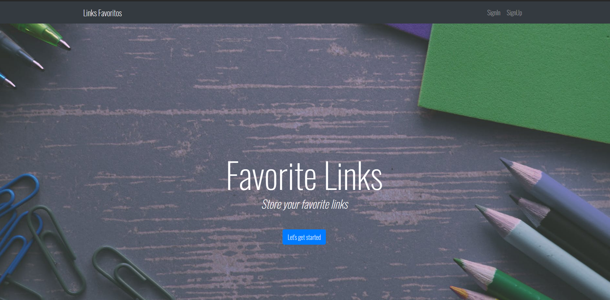
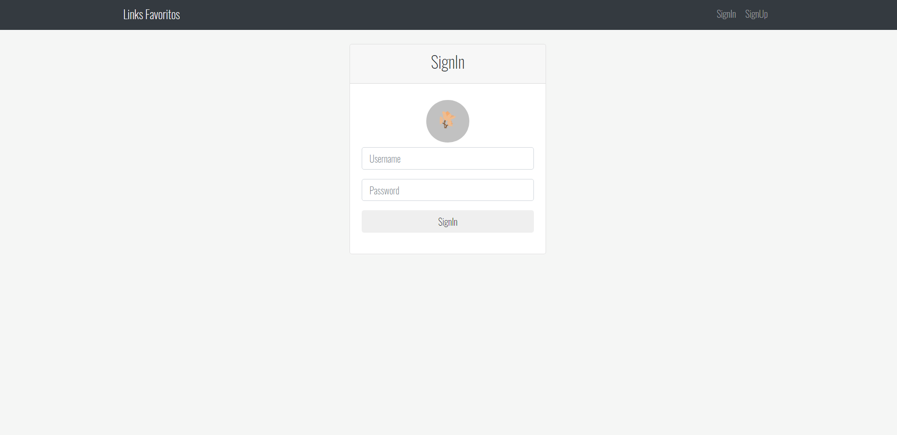
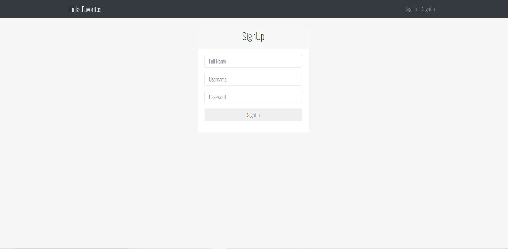

    Aprendendo a criar uma aplicação web, backend e frontend, 
    utilizando Nodejs, mysql, express e outras tantas tecnologias de Javascript, 
    com base no seguinte tutorial: https://www.youtube.com/watch?v=qJ5R9WTW0_E

    
    
    

